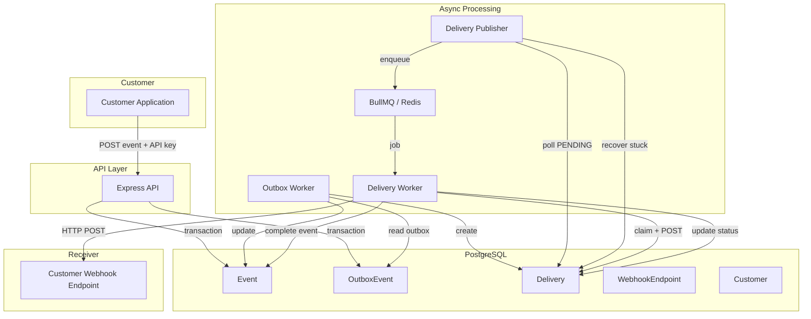
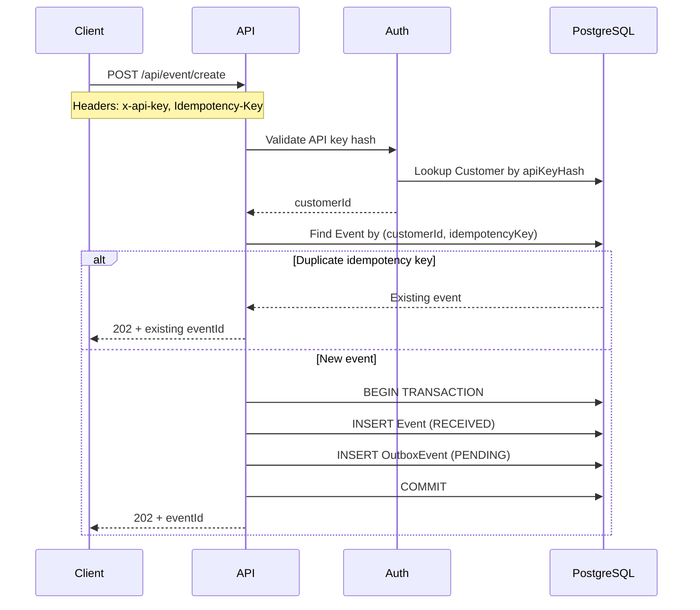
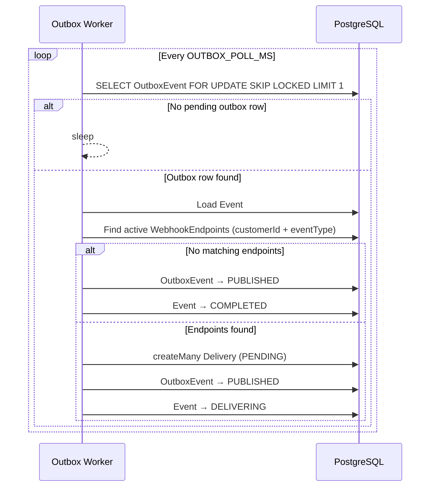
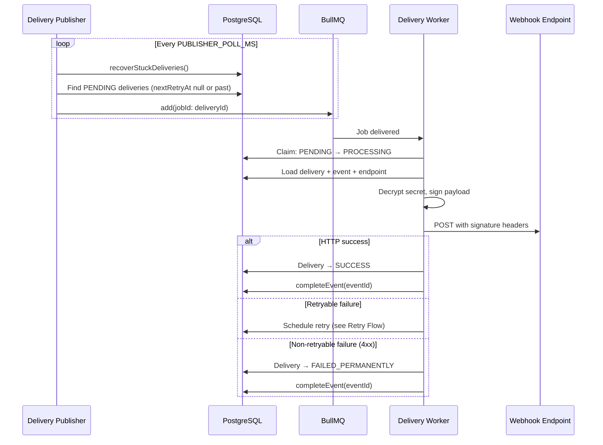
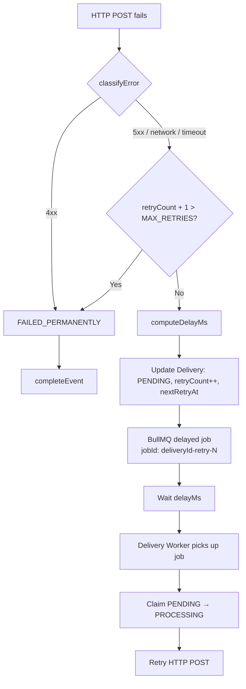
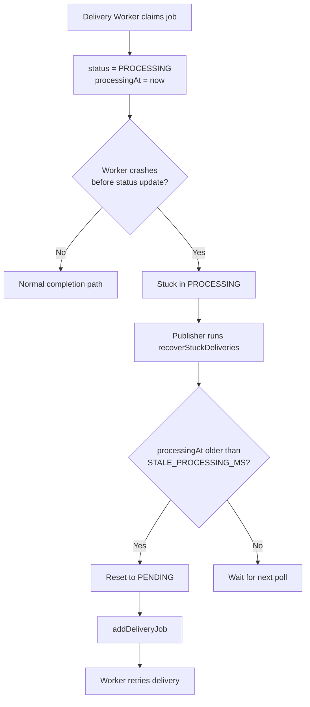
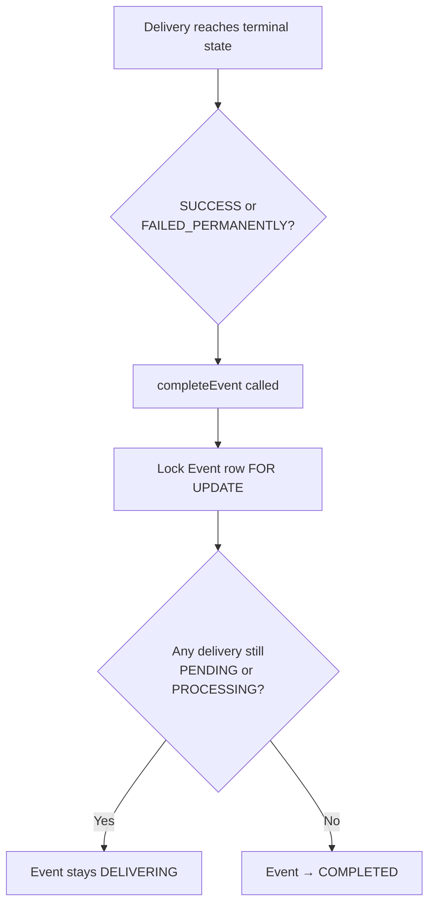
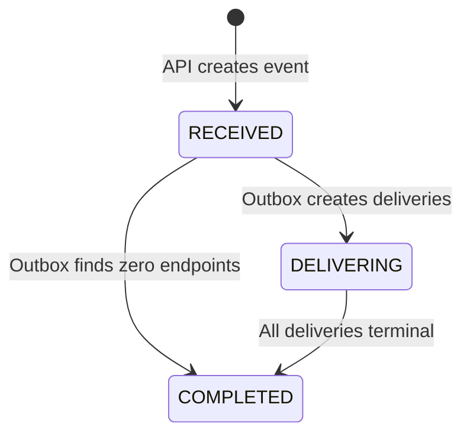
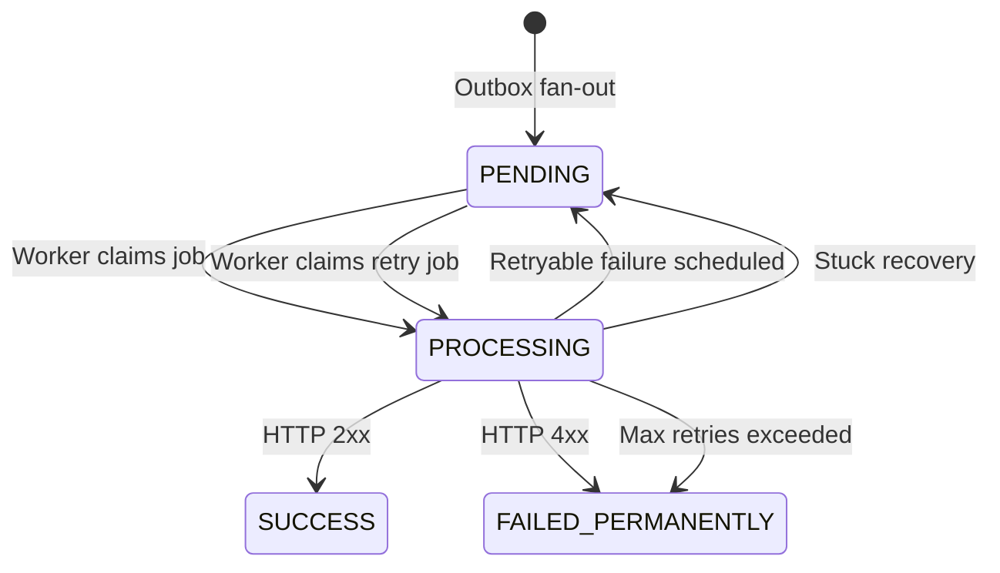

# Architecture & Design Decisions

This document describes the end-to-end architecture of the Webhook Delivery System, including flow diagrams and the rationale behind major design choices.

---

## Table of Contents

1. [System Overview](#system-overview)
2. [High-Level Architecture](#high-level-architecture)
3. [Event Ingestion Flow](#event-ingestion-flow)
4. [Outbox Fan-Out Flow](#outbox-fan-out-flow)
5. [Delivery Pipeline Flow](#delivery-pipeline-flow)
6. [Retry Flow](#retry-flow)
7. [Stuck Delivery Recovery Flow](#stuck-delivery-recovery-flow)
8. [Event Completion Flow](#event-completion-flow)
9. [State Machines](#state-machines)
10. [Design Decisions](#design-decisions)

---

## System Overview

The system accepts events from authenticated customers, fans them out to registered webhook endpoints, and delivers signed HTTP POST requests asynchronously. PostgreSQL is the durable source of truth for all business state. Redis and BullMQ are used only for job scheduling and execution.

### Runtime Processes

| Process | Entry point | Responsibility |
|---------|-------------|----------------|
| API Server | `src/server.ts` | REST API, auth, validation, event ingestion |
| Outbox Worker | `src/workers/index.ts` | Fan-out events to delivery records |
| Delivery Publisher | `src/publishers/deliveryPublisher/index.ts` | Enqueue deliveries, recover stuck jobs |
| Delivery Worker | `src/workers/deliveryWorker/index.ts` | Execute HTTP webhook deliveries |

---

## High-Level Architecture



---

## Event Ingestion Flow



### Key behaviors

* Returns `202 Accepted` — delivery is asynchronous.
* Idempotency is scoped per customer: `@@unique([customerId, idempotencyKey])`.
* Race on duplicate insert is handled via Prisma `P2002` fallback lookup.

---

## Outbox Fan-Out Flow



### Why transactional outbox?

The API commits the event and outbox record atomically. The outbox worker guarantees that fan-out eventually happens even if the API process crashes immediately after responding. This avoids dual-write problems (DB + queue).

---

## Delivery Pipeline Flow



---

## Retry Flow



### Retry policy

| Failure type | Retry? |
|--------------|--------|
| HTTP 5xx | Yes |
| Network error (no response) | Yes |
| Timeout (`ECONNABORTED`, `ETIMEDOUT`) | Yes |
| HTTP 4xx | No |
| Unknown errors | Yes (default) |

| Setting | Default | Env var |
|---------|---------|---------|
| Max retries | 5 | `DELIVERY_MAX_RETRIES` |
| Base delay | 1s | `DELIVERY_BASE_DELAY_MS` |
| Max delay | 60s | `DELIVERY_MAX_DELAY_MS` |
| HTTP timeout | 10s | `DELIVERY_TIMEOUT_MS` |
| Jitter | 0–25% of exponential delay | built-in |
| Retry-After | `max(backoff, Retry-After)` capped at max delay | from response header |

---

## Stuck Delivery Recovery Flow



Default stale threshold: `max(DELIVERY_TIMEOUT_MS × 3, 60s)`, overridable via `DELIVERY_STALE_PROCESSING_MS` (default 5 minutes in `.env.example`).

---

## Event Completion Flow



**Definition of COMPLETED:** all deliveries for the event have finished attempting delivery, regardless of individual success or failure.

Events with zero matching endpoints are marked `COMPLETED` immediately by the outbox worker.

---

## State Machines

### Event Status



Note: `FANOUT_IN_PROGRESS` exists in the schema but is not currently used in code.

### Delivery Status



Note: `FAILED` exists in the schema but is not used; the system uses `FAILED_PERMANENTLY` or returns to `PENDING` for retries.

---

## Design Decisions

Each decision follows the format: **Context → Decision → Rationale → Trade-offs**.

---

### ADR-001: PostgreSQL as source of truth, Redis for jobs only

**Context:** Delivery state must survive Redis restarts and be queryable for debugging.

**Decision:** All durable state (`Event`, `Delivery`, `OutboxEvent`, etc.) lives in PostgreSQL. Redis/BullMQ is used exclusively for job scheduling and worker coordination.

**Rationale:** Postgres provides ACID transactions, durable storage, and rich querying. Redis is fast but ephemeral.

**Trade-offs:** Requires a polling publisher to bridge Postgres → BullMQ. Slightly higher latency than writing directly to the queue on ingest.

---

### ADR-002: Transactional outbox pattern

**Context:** Event ingestion must not lose fan-out if the process crashes after accepting an event.

**Decision:** Create `Event` and `OutboxEvent` in a single database transaction. A separate outbox worker performs fan-out asynchronously.

**Rationale:** Guarantees at-least-once fan-out without coupling the API to queue availability.

**Trade-offs:** Additional worker process and polling latency (typically ~1s).

---

### ADR-003: Four separate processes

**Context:** API, fan-out, publishing, and HTTP delivery have different scaling and failure profiles.

**Decision:** Run API, outbox worker, delivery publisher, and delivery worker as independent processes. Development uses `npm run start:all` (concurrently); production should run each separately.

**Rationale:** Independent scaling (e.g. more delivery workers under load), isolated failures, clear separation of concerns.

**Trade-offs:** More operational complexity than a monolith.

---

### ADR-004: App-controlled retries via BullMQ delayed jobs

**Context:** Retry policy requires custom classification (4xx vs 5xx), Postgres-tracked retry counts, jitter, and `Retry-After` header support.

**Decision:**
* BullMQ `attempts: 1` (no built-in retry/backoff)
* On retryable failure: update Postgres (`retryCount`, `nextRetryAt`, `lastError`) and enqueue a new delayed job with `jobId: ${deliveryId}-retry-${retryCount}`

**Rationale:** Full control over retry semantics. Postgres remains authoritative for retry state.

**Trade-offs:** More code than BullMQ native retries. Must explicitly schedule each retry.

---

### ADR-005: Retry classification rules

**Context:** Subscribers may return 4xx for bad payloads (never retry) vs 5xx for transient errors (retry).

**Decision:**
* **Retry:** 5xx, network errors, timeouts
* **Do not retry:** 4xx

**Rationale:** Retrying 4xx wastes resources and can amplify client errors.

**Trade-offs:** HTTP 429 (rate limit) is currently treated as non-retryable 4xx. Some systems retry 429 with `Retry-After` — this is a known future improvement.

---

### ADR-006: Exponential backoff with jitter and Retry-After

**Context:** Retries must avoid thundering herd and respect subscriber rate limits.

**Decision:**
* Delay = `min(baseDelay × 2^(retryCount-1), maxDelay)` + random jitter (0–25%)
* If `Retry-After` header present: `max(computedDelay, retryAfterMs)` capped at max delay

**Rationale:** Standard industry pattern for webhook retry scheduling.

**Trade-offs:** Non-deterministic delays make testing slightly harder.

---

### ADR-007: Claim pattern (PENDING → PROCESSING)

**Context:** Multiple workers must not deliver the same webhook concurrently.

**Decision:** Worker atomically updates `PENDING → PROCESSING` with `processingAt` before making the HTTP request. If `updateMany` affects 0 rows, the job is skipped (already claimed or not ready).

**Rationale:** Simple optimistic locking without distributed locks.

**Trade-offs:** Crashed workers leave rows in `PROCESSING` — addressed by stuck recovery (ADR-010).

---

### ADR-008: Publisher polling with jobId deduplication

**Context:** Deliveries start as Postgres rows; something must move them to BullMQ.

**Decision:** Publisher polls `PENDING` deliveries every `PUBLISHER_POLL_MS` and enqueues with `jobId: deliveryId`. Duplicate enqueue attempts are ignored if the job already exists.

**Rationale:** Postgres remains source of truth. Publisher is a reconciler, not the authority.

**Trade-offs:** Poll interval adds latency (3s dev / 1s prod default). Retries with future `nextRetryAt` are excluded from polling and handled by delayed BullMQ jobs instead.

---

### ADR-009: API key hashing vs endpoint secret encryption

**Context:** Two types of secrets with different requirements.

**Decision:**
| Secret | Storage | Algorithm | Recoverable? |
|--------|---------|-----------|--------------|
| Customer API key | SHA-256 hash | One-way | No — re-issue on regenerate |
| Endpoint signing secret | AES-256-GCM | Symmetric encryption | Yes — needed to sign outbound webhooks |

**Rationale:** API keys only need verification. Endpoint secrets must be decrypted at delivery time.

**Trade-offs:** Encrypted secrets require a managed `ENCRYPTION_KEY` in environment/secrets manager.

---

### ADR-010: Stuck PROCESSING recovery in publisher

**Context:** Worker crash after claim leaves deliveries permanently stuck in `PROCESSING`.

**Decision:** Publisher runs `recoverStuckDeliveries()` each poll cycle. Deliveries in `PROCESSING` with `processingAt` older than `DELIVERY_STALE_PROCESSING_MS` are reset to `PENDING` and re-enqueued.

**Rationale:** Safety net without a separate cron process. Publisher already polls deliveries.

**Trade-offs:** Threshold must exceed worst-case delivery time to avoid false recovery during slow requests.

---

### ADR-011: Event completion on all terminal deliveries

**Context:** Customers need to know when an event is fully processed.

**Decision:** After each delivery reaches `SUCCESS` or `FAILED_PERMANENTLY`, call `completeEvent(eventId)`. Event moves `DELIVERING → COMPLETED` only when zero deliveries remain in `PENDING` or `PROCESSING`.

**Rationale:** `COMPLETED` means "all delivery attempts finished," not "all succeeded."

**Trade-offs:** `completeEvent` runs in a separate transaction from delivery update (small window for inconsistency on crash — recoverable on next terminal delivery).

**Implementation details:**
* Row lock on event (`FOR UPDATE`) prevents concurrent completion races
* `updateMany` with `status: DELIVERING` filter avoids errors when event already completed

---

### ADR-012: Idempotency at ingest and outbound

**Context:** Clients may retry event submission; webhook subscribers may receive duplicate deliveries.

**Decision:**
* **Ingest:** `Idempotency-Key` header + `@@unique([customerId, idempotencyKey])`
* **Outbound:** Same `Idempotency-Key` sent on every delivery attempt for an event
* **Dedup ID:** `X-Webhook-Id` (delivery UUID) sent on every attempt for a specific delivery row

**Rationale:** Ingest idempotency prevents duplicate events. Outbound headers let receivers deduplicate at-least-once delivery.

**Trade-offs:** Delivery is at-least-once, not exactly-once. Receivers must implement deduplication.

---

### ADR-013: HMAC-SHA256 webhook signatures

**Context:** Receivers must verify webhooks genuinely originated from this system.

**Decision:**
```text
signedPayload = timestamp + "." + JSON.stringify(payload)
X-Webhook-Signature = "sha256=" + HMAC-SHA256(endpointSecret, signedPayload)
```

Also send `X-Webhook-Timestamp` for replay protection (verification left to receiver).

**Rationale:** Industry-standard signed webhook pattern (similar to Stripe/GitHub).

**Trade-offs:** Receiver must implement verification. Timestamp tolerance window is not enforced by this system.

---

### ADR-014: Outbox concurrency with FOR UPDATE SKIP LOCKED

**Context:** Multiple outbox worker instances may run concurrently.

**Decision:** Use raw SQL `SELECT ... FOR UPDATE SKIP LOCKED LIMIT 1` to claim one outbox row per transaction.

**Rationale:** Prevents double fan-out without a separate distributed lock service.

**Trade-offs:** Raw SQL bypasses Prisma's type-safe query builder for this one operation.

---

### ADR-015: Soft delete for customers and endpoints

**Context:** Hard deletes would orphan deliveries and break audit trails.

**Decision:**
* Customers: status enum (`ACTIVE`, `DEACTIVATION_REQUESTED`, `INACTIVE`)
* Endpoints: `isActive` boolean

**Rationale:** Preserve history while preventing new deliveries to inactive resources.

**Trade-offs:** Inactive endpoints are filtered at fan-out time; already-created deliveries are not automatically cancelled.

---

### ADR-016: Centralized configuration with Zod validation

**Context:** Environment variables were scattered across files with inconsistent dev/prod behavior.

**Decision:** Single `src/config/config.ts` validates env vars with Zod. All modules import `config`. Dev fallbacks for `DATABASE_URL` and `REDIS_URL` only.

**Rationale:** Fail fast on misconfiguration. Clear dev vs prod defaults.

**Trade-offs:** `ENCRYPTION_KEY` is always required (no dev fallback) — must be set in `.env`.

---

### ADR-017: Prisma 7 with PostgreSQL driver adapter

**Context:** Prisma 7 requires explicit driver adapters for direct database connections.

**Decision:** Use `@prisma/adapter-pg` with generated client at `generated/prisma/`.

**Rationale:** Required for Prisma 7 compatibility.

**Trade-offs:** Generated client must be regenerated after schema changes (`npx prisma generate`).

---

### ADR-018: At-least-once delivery semantics

**Context:** Network failures can occur after the receiver processes a webhook but before the worker records success.

**Decision:** Accept at-least-once delivery. Provide `X-Webhook-Id` and `Idempotency-Key` for receiver-side deduplication.

**Rationale:** Exactly-once delivery between distributed systems without distributed transactions is impractical.

**Trade-offs:** Receivers must be idempotent.

---

## Data Model Decisions

| Constraint | Purpose |
|------------|---------|
| `@@unique([customerId, idempotencyKey])` on Event | Prevent duplicate event ingestion per customer |
| `@@unique([eventId, endpointId])` on Delivery | One delivery row per event-endpoint pair |
| `@@unique([customerId, url, eventType])` on WebhookEndpoint | Prevent duplicate endpoint registration |
| `@@index([status, nextRetryAt])` on Delivery | Efficient publisher queries |
| `@@index([status, createdAt])` on OutboxEvent | Efficient outbox polling |

---

## Known Limitations & Future Work

| Area | Current state | Potential improvement |
|------|---------------|----------------------|
| Event/delivery read APIs | Not implemented | `GET /api/event/:id` with deliveries |
| HTTP 429 | Treated as non-retryable 4xx | Retry with `Retry-After` |
| `DeliveryStatus.FAILED` | Defined but unused | Remove or use for transient failures |
| `EventStatus.FANOUT_IN_PROGRESS` | Defined but unused | Remove or use during fan-out |
| SSRF protection | Not implemented | Validate endpoint URLs on registration |
| Structured logging | pino installed, not wired | Add request/job logging |
| Graceful shutdown | Not implemented | Close BullMQ + Prisma on SIGTERM |
| Automated tests | Placeholder only | Unit tests for retry/signature; E2E pipeline test |
| DB ↔ queue atomicity on retry | Separate transactions | Outbox pattern for retry enqueue |

---

## Related Documents

* [README.md](../README.md) — setup, API reference, and quick start
* [.env.example](../.env.example) — environment variable reference
